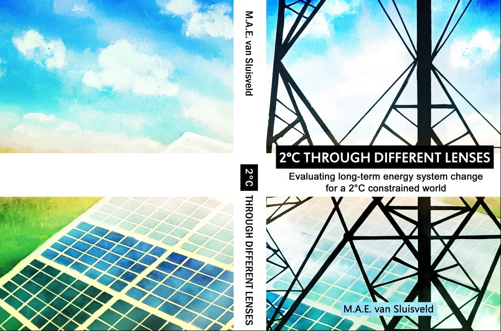

<!--StartFragment-->

On July 4th, 2017, researcher Mariësse van Sluisveld obtained her PhD at Utrecht University. The main conclusion of her research is that, in order to stay well below the 2°C climate objective, it is essential to combine different sources of knowledge.

The 2015 United Nations Climate Change Conference in Paris (COP21) agreed upon limiting global mean temperature increase to less than 2°C compared to pre-industrial levels and pursue efforts towards limiting temperature increase to 1.5°C. Policymakers that face this climate objective are confronted with difficult questions about how this goal can be achieved. Several fields of research, methods and tools are available to help shape our understanding of the needed change to attain the above-mentioned climate objective, including the use of historical references to draw lessons from the past for the future, expert knowledge on current trends and future transition routes and model-based scenarios that allow to explore different future pathways under specific conditions and climate policies.  

Model-based scenarios, developed by Integrated Assessment Models (IAMs), have proven to be helpful in informing policy makers about key elements of long-term systemic change in the past. However, as insights are generally based on simplified and idealised assumptions on future system change, these studies may be considered as being more of an exploratory rather than predictive nature. It is therefore relevant to assess the ability of IAMs to represent future system change and thereby their ability to inform policy makers on meeting a long-term climate objective. By placing IAM outcomes in the light of other fields of knowledge one can evaluate whether IAMs are able to complement or contrast the various perspectives on future system change.  

In this dissertation, three perspectives have been systematically compared to identify the commonalities and differences in prospected future change. First, various IAMs have been compared amongst each other to study the robust patterns in model-based scenario analyses looking into limiting global mean temperature increase to 2°C. Secondly, the projected future rates of change by IAMs have been compared to rates of change as observed in the past. Thirdly, the projected rates of change by IAMs have been compared to rates of change as estimated by experts in the field of various energy technologies. To move beyond the existing conceptualisation of systems change as devised by IAMs - which is often based on economics, engineering, and natural sciences - new approaches to broaden the scope of IAMs have been developed and researched. In a final study the national arrangements and policy-evaluation processes for long-term climate policy have been analysed.  

The dissertation concludes that a broader perspective on future system change allows a more critical appraisal of the considered future opportunities and challenges in a disciplinary field. Overall agreement between the various perspectives has been found for the 2°C development trajectory for wind power towards 2050, whereas differences in perspective have been revealed for other (energy) technologies, particularly nuclear power, bioelectricity and carbon capture and storage. However, in order to come to a more holistic view on future system change in line with the 2°C climate objective, further research may focus on broadening the scope of assessment. Considered avenues are the inclusion of a broader system view, greater engagement with other fields of research and the development of alternative transition pathways.

**Full thesis can be accessed at**: <http://dspace.library.uu.nl/handle/1874/350885>

<!--EndFragment-->